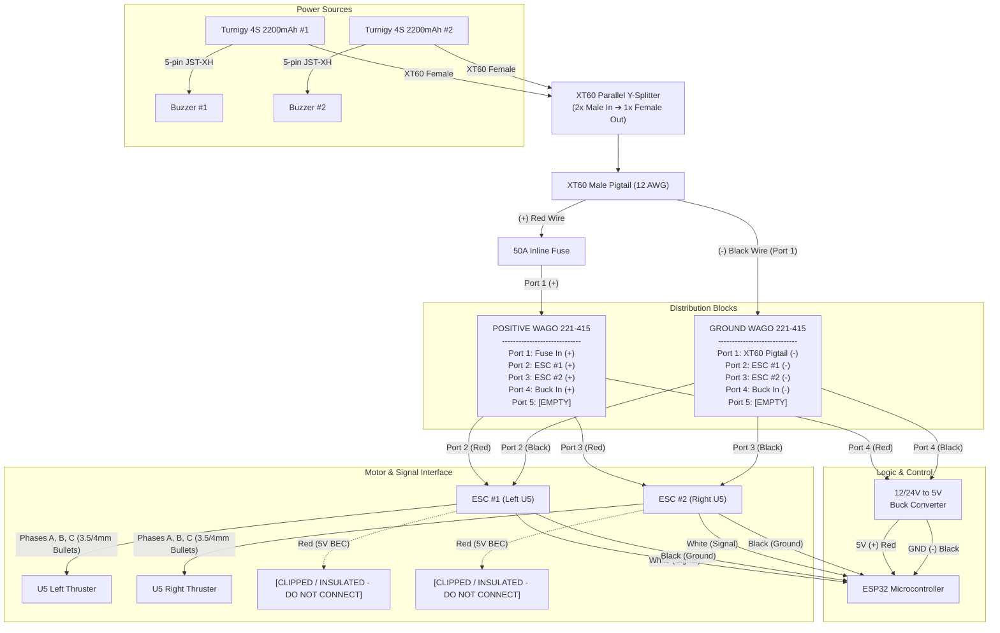

# Power Distribution & Motor/Signal Wiring Diagram

```mermaid
flowchart TD
    %% ================= POWER DISTRIBUTION =================
    subgraph PowerSource ["Power Sources"]
        BATT1["Turnigy 4S 2200mAh #1"]
        BATT2["Turnigy 4S 2200mAh #2"]
        BUZZ1["Buzzer #1"]
        BUZZ2["Buzzer #2"]

        BATT1 -->|"5-pin JST-XH"| BUZZ1
        BATT2 -->|"5-pin JST-XH"| BUZZ2
    end

    SPLITTER["XT60 Parallel Y-Splitter<br/>(2x Male In ➔ 1x Female Out)"]
    BATT1 -->|"XT60 Female"| SPLITTER
    BATT2 -->|"XT60 Female"| SPLITTER

    PIGTAIL["XT60 Male Pigtail (12 AWG)"]
    SPLITTER --> PIGTAIL

    FUSE["50A Inline Fuse"]
    PIGTAIL -->|"(+) Red Wire"| FUSE

    subgraph DistributionBlocks ["Distribution Blocks"]
        WAGO_POS["POSITIVE WAGO 221-415<br/>-----------------------------<br/>Port 1: Fuse In (+)<br/>Port 2: ESC #1 (+)<br/>Port 3: ESC #2 (+)<br/>Port 4: Buck In (+)<br/>Port 5: [EMPTY]"]
        WAGO_GND["GROUND WAGO 221-415<br/>-----------------------------<br/>Port 1: XT60 Pigtail (-)<br/>Port 2: ESC #1 (-)<br/>Port 3: ESC #2 (-)<br/>Port 4: Buck In (-)<br/>Port 5: [EMPTY]"]
    end

    FUSE -->|"Port 1 (+)"| WAGO_POS
    PIGTAIL -->|"(-) Black Wire (Port 1)"| WAGO_GND

    %% ================= LOGIC & STEP-DOWN =================
    subgraph LogicControl ["Logic & Control"]
        BUCK["12/24V to 5V<br/>Buck Converter"]
        ESP32["ESP32 Microcontroller"]
        
        WAGO_POS -->|"Port 4 (Red)"| BUCK
        WAGO_GND -->|"Port 4 (Black)"| BUCK
        
        BUCK -->|"5V (+) Red"| ESP32
        BUCK -->|"GND (-) Black"| ESP32
    end

    %% ================= MOTOR & SIGNAL INTERFACE =================
    subgraph DriveSystem ["Motor & Signal Interface"]
        ESC1["ESC #1 (Left U5)"]
        ESC2["ESC #2 (Right U5)"]
        THRUSTER_L["U5 Left Thruster"]
        THRUSTER_R["U5 Right Thruster"]
        BEC_ISO1["[CLIPPED / INSULATED - DO NOT CONNECT]"]
        BEC_ISO2["[CLIPPED / INSULATED - DO NOT CONNECT]"]

        %% Power to ESCs
        WAGO_POS -->|"Port 2 (Red)"| ESC1
        WAGO_GND -->|"Port 2 (Black)"| ESC1
        WAGO_POS -->|"Port 3 (Red)"| ESC2
        WAGO_GND -->|"Port 3 (Black)"| ESC2

        %% Motor Phases
        ESC1 -->|"Phases A, B, C (3.5/4mm Bullets)"| THRUSTER_L
        ESC2 -->|"Phases A, B, C (3.5/4mm Bullets)"| THRUSTER_R

        %% Servo Leads ESC 1
        ESC1 -->|"White (Signal)"| ESP32
        ESC1 -->|"Black (Ground)"| ESP32
        ESC1 -.->|"Red (5V BEC)"| BEC_ISO1

        %% Servo Leads ESC 2
        ESC2 -->|"White (Signal)"| ESP32
        ESC2 -->|"Black (Ground)"| ESP32
        ESC2 -.->|"Red (5V BEC)"| BEC_ISO2
    end
```
